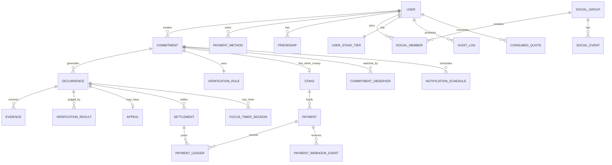

# ERD — 한국형 Commitment App
> 버전: v1.0 (Phase 3 개정)  
> 목적: MVP 핵심 데이터 모델을 정의한다.

---

## 1. 설계 원칙

- 사용자가 만드는 **Commitment**가 중심 엔터티
- 각 Commitment는 `enforcement_mode`로 SELF / SOCIAL / MONEY 중 하나를 갖는다.
- **Stake는 MONEY 모드 Commitment에만 존재한다.** SELF/SOCIAL을 표현하기 위해 0원 Stake row를 만들지 않는다 (Commitment 1 → 0..1 Stake).
- Quote/Payment도 MONEY 모드에서만 발생한다. SELF/SOCIAL Commitment는 quote 없이 활성화된다.
- 반복 약속은 `Commitment`와 실제 실행 단위인 `Occurrence`를 분리
- 결제는 약속 전체 선결제, 성공/실패는 회차별 정산 (MONEY 전용)
- Verification은 플러그인 구조이며 세 모드 모두 동일하게 PASS/UNCERTAIN/FAIL을 산출한다.
- 증거(Evidence), 판정(Verification Result), Appeal은 분리
- 친구/Social은 금전 흐름과 분리 — 친구는 실패금을 받지 않는다.
- Server Time을 기준으로 상태를 결정
- 모든 금전 상태 변경은 Ledger로 남김
- Stake 상한/추천 금액은 서버 `StakePolicy`가 강제하며 클라이언트는 authoritative가 아니다.

---

## 2. Mermaid ERD



---

## 3. 핵심 엔터티

### USER
| 필드 | 타입 | 설명 |
|---|---|---|
| id | UUID | PK |
| email | varchar | 이메일 |
| auth_provider | enum | apple/google/email |
| display_name | varchar | 이름 |
| birth_date | date nullable | 표시용. MONEY 성인 게이트의 근거가 아님 |
| age_verification_status | enum | unknown / verified_adult / underage |
| age_verified_at | timestamptz nullable | 서버 확인 시각 |
| locale | varchar | ko-KR |
| timezone | varchar | Asia/Seoul |
| status | enum | active/suspended/deleted |
| created_at | timestamptz | 생성 |
| updated_at | timestamptz | 수정 |

---

### COMMITMENT
| 필드 | 타입 | 설명 |
|---|---|---|
| id | UUID | PK |
| user_id | UUID | FK |
| title | varchar | 약속명 |
| category | enum | wakeup/workout/study/read/meditate/screen/custom |
| direction | enum | do/avoid |
| enforcement_mode | enum | SELF / SOCIAL / MONEY — 사용자가 고른 강제력 |
| schedule_type | enum | one_time/daily/specific_days/x_per_week/custom |
| schedule_json | jsonb | 반복 규칙 |
| start_at | timestamptz | 시작 |
| end_at | timestamptz | 종료 |
| timezone | varchar | 생성 시 고정 |
| strictness | enum | normal/hard |
| extension_allowed | boolean | 연장 허용 |
| status | enum | draft/payment_pending/signature_pending/active/completed/cancelled |
| max_loss_amount | bigint nullable | 전체 최대 손실 — MONEY 전용, SELF/SOCIAL은 NULL |
| currency | char(3) nullable | KRW — MONEY 전용 |
| signed_at | timestamptz | 서명 완료 시각 |
| signature_completed | boolean | true when the signature ritual finished |
| signature_expires_at | timestamptz nullable | MONEY: 선결제 성공 시각 + 설정 만료(기본 30분) |
| cancelled_at | timestamptz nullable | 서명 전 취소/만료 시각 |
| cancellation_requested_at | timestamptz nullable | 활성 취소 요청이자 금전 컷오프 |
| cancellation_effective_at | timestamptz nullable | 미래 회차 VOID 기준 시각. MONEY는 요청+24h |
| cancellation_reason | enum nullable | user_cancelled / signature_expired |
| contract_version | varchar | "v1" 등 계약 문구 버전 |
| created_at | timestamptz | |
| updated_at | timestamptz | |

> **서명은 이미지로 보관하지 않는다.** 서명은 법적 서명이 아닌 행동 커밋 의식(ritual)이다. `signed_at`, `signature_completed`, `contract_version`만 남긴다. 과거 명세의 `signature_asset_id`는 삭제되었다.

### 강제력 모드별 필드 유효성
- **SELF**: `max_loss_amount = NULL`, `currency = NULL`, Stake row 없음, Payment 없음, ConsumedQuote 없음.
- **SOCIAL**: SELF와 동일한 재무 상태. Release에서는 verifier 관계가 없으면 활성화 불가. Observer(CommitmentObserver) 관계로만 표현.
- **MONEY**: Stake row 1개, `max_loss_amount` 필수, quote 필수 (`consumed_quotes` 참조), 이후 Payment/Settlement 흐름 활성화.

---

### OCCURRENCE
반복 약속의 각 실행 회차.

| 필드 | 타입 | 설명 |
|---|---|---|
| id | UUID | PK |
| commitment_id | UUID | FK |
| sequence_no | int | 회차 |
| window_start_at | timestamptz | 수행 시작 |
| deadline_at | timestamptz | 수행/증명 마감 |
| status | enum | scheduled/active/evidence_submitted/reviewing/pass/uncertain/fail/void |
| stake_amount | bigint | 회차당 약속금 |
| failure_reason_code | varchar nullable | 실패 이유 |
| decided_at | timestamptz nullable | 판정 시각 |
| appeal_opened_at | timestamptz nullable | FAIL 시 항소 창 시작. 이후 설정으로 재계산하지 않음 |
| appeal_deadline_at | timestamptz nullable | FAIL 확정 시각. persisted |
| created_at | timestamptz | |

---

### VERIFICATION_RULE
| 필드 | 타입 | 설명 |
|---|---|---|
| id | UUID | PK |
| commitment_id | UUID | FK unique |
| method | enum | photo/gps/timer/self/friend/health/screen_time/timelapse |
| rule_json | jsonb | 방식별 규칙 |
| ai_threshold | numeric nullable | AI 판정 기준 |
| fallback_type | enum nullable | appeal/manual/additional_evidence |
| created_at | timestamptz | |

예시 `rule_json` (GPS)
```json
{
  "method": "gps",
  "lat": 37.123,
  "lng": 127.123,
  "radius_m": 150,
  "user_selected": true,
  "label": "우리집 헬스장",
  "must_enter_before_deadline": true
}
```

> `user_selected: true`가 없으면 서버는 활성화를 거부한다. 이 규칙은 클라이언트가 하드코딩 기본좌표로 사용자 몰래 GPS 약속을 만드는 것을 막기 위한 것이다.

---

### EVIDENCE
| 필드 | 타입 | 설명 |
|---|---|---|
| id | UUID | PK |
| occurrence_id | UUID | FK |
| submitted_by_user_id | UUID | FK |
| evidence_type | enum | photo/video/location/timer/self/friend |
| storage_key | varchar nullable | 파일 위치 (사진/영상) |
| captured_at | timestamptz nullable | 촬영/측정 시각 (클라이언트) |
| received_at | timestamptz | 서버 수신 |
| metadata_json | jsonb | EXIF, 위치, 정확도, 세션 정보 등 |
| hash | varchar nullable | 재사용 탐지 (사진 SHA-256 등) |
| retention_until | timestamptz | 삭제 예정 |
| created_at | timestamptz | |

증거 타입별 `metadata_json` 예:

**photo**
```json
{
  "type": "photo",
  "content_type": "image/jpeg",
  "size_bytes": 812043,
  "device_captured_at": "2026-09-05T12:30:00Z",
  "hash_algo": "sha256"
}
```

**location (GPS)**
```json
{
  "type": "location",
  "lat": 37.501,
  "lng": 127.039,
  "accuracy_m": 12.3,
  "target_lat": 37.502,
  "target_lng": 127.040,
  "target_radius_m": 150,
  "distance_m": 84.2,
  "device_captured_at": "2026-09-05T12:29:55Z"
}
```

**timer**
```json
{
  "type": "timer",
  "session_id": "ts_...",
  "planned_duration_s": 3600,
  "elapsed_s": 3601,
  "heartbeats": 61,
  "max_gap_s": 63,
  "background_events": 0
}
```

**self**
```json
{
  "type": "self",
  "user_answer": "kept" | "missed"
}
```

---

### VERIFICATION_RESULT
| 필드 | 타입 | 설명 |
|---|---|---|
| id | UUID | PK |
| occurrence_id | UUID | FK |
| evidence_id | UUID nullable | 채택된 증거 (있을 때) |
| verifier_type | enum | rule/ai/friend/human/self/timer/gps |
| result | enum | pass/uncertain/fail |
| confidence | numeric nullable | AI 확신 (0..1) |
| reason_code | varchar | 이유 (기계 식별용) |
| reason_text | text | 사용자 노출 가능 설명 |
| user_message | text | 결과 화면에 보여줄 짧은 한국어 문구 |
| model_version | varchar nullable | AI 모델 |
| reviewer_user_id | UUID nullable | friend/human |
| created_at | timestamptz | |

> **원칙**: Verification 모듈은 오직 `pass/uncertain/fail`만 결정한다. 금전 정산은 절대 이 모듈에서 실행되지 않는다. 정산 워커(Phase 4)가 이 결과를 소비할 뿐이다.

---

### STAKE (MONEY 전용)
Commitment 1 → **0..1** Stake. MONEY 모드 Commitment에만 존재한다. SELF/SOCIAL은 Stake row가 존재하지 않는다 (0원 Stake 금지).

| 필드 | 타입 | 설명 |
|---|---|---|
| id | UUID | PK |
| commitment_id | UUID | FK unique |
| per_occurrence_amount | bigint | 회차당 금액 |
| max_total_amount | bigint | 전체 최대 |
| currency | char(3) | KRW |
| settlement_mode | enum | end_of_commitment/per_occurrence |
| recipient_type | enum | platform |
| status | enum | pending/funded/settling/settled/refunded |
| funded_at | timestamptz nullable | upfront charge 성공 시각 |
| settled_at | timestamptz nullable | 모든 회차 정산 완료 시각 |
| refunded_at | timestamptz nullable | aggregate refund 성공 시각 |
| created_at | timestamptz | |

---

### PAYMENT
| 필드 | 타입 | 설명 |
|---|---|---|
| id | UUID | PK |
| user_id | UUID | FK |
| stake_id | UUID nullable | FK |
| commitment_id | UUID nullable | FK (조회용 비정규화) |
| provider | varchar | PG (mock / kcp). 카카오페이는 provider가 아님 |
| payment_method | varchar nullable | CARD / KAKAOPAY / BANK |
| provider_payment_key | varchar | PG payment key |
| idempotency_key | varchar | unique. charge: `charge:{commitmentId}:{attempt}`, refund: `refund:{commitmentId}:{attempt}` |
| attempt | int | 재시도 순번 |
| type | enum | charge/refund/cancel |
| amount | bigint | |
| currency | char(3) | KRW |
| status | enum | requested/succeeded/failed/partial |
| failure_code | varchar nullable | |
| created_at | timestamptz | |
| completed_at | timestamptz nullable | |

---

### PAYMENT_WEBHOOK_EVENT
PG inbound webhook의 중복 처리 방지 기록.

| 필드 | 타입 | 설명 |
|---|---|---|
| id | UUID | PK |
| provider | varchar | |
| event_id | varchar | `(provider, event_id)` unique |
| payment_id | UUID nullable | FK |
| event_type | varchar | |
| payload | jsonb | 원문 |
| received_at | timestamptz | |
| processed_at | timestamptz nullable | |

---

### PAYMENT_LEDGER
회계/정산 변경을 append-only로 저장.

| 필드 | 타입 | 설명 |
|---|---|---|
| id | UUID | PK |
| user_id | UUID | FK |
| commitment_id | UUID | FK |
| occurrence_id | UUID nullable | FK |
| payment_id | UUID nullable | FK |
| entry_type | enum | deposit/refund_earned/refund_paid/forfeit/reversal |
| amount | bigint | |
| balance_after | bigint nullable | 내부 계산용 |
| created_at | timestamptz | |

---

### SETTLEMENT
| 필드 | 타입 | 설명 |
|---|---|---|
| id | UUID | PK |
| occurrence_id | UUID | FK unique (회차당 1건) |
| idempotency_key | varchar | unique. 중복 정산 차단 |
| result | enum | refundable/forfeited/void |
| amount | bigint | |
| status | enum | pending/processed/failed |
| processed_at | timestamptz nullable | |

정산 규칙: PASS → refundable, FAIL → forfeited, VOID → refundable(void). UNCERTAIN / system_hold 회차에는 Settlement row를 만들지 않는다. 회차별 환불은 없고, 모든 회차가 종결되면 `upfront − Σforfeited`를 aggregate refund 1회로 지급한다.

---

### APPEAL
| 필드 | 타입 | 설명 |
|---|---|---|
| id | UUID | PK |
| occurrence_id | UUID | FK unique |
| user_id | UUID | FK |
| reason_category | varchar | verification_error / evidence_misread / other |
| reason_text | text | 짧은 설명 |
| original_result | varchar | 제출 시점 원판정 (FAIL). 불변 |
| corrected_result | varchar nullable | 승인 시 PASS 또는 VOID |
| status | enum | submitted/reviewing/approved/rejected |
| reviewer_type | enum | ai/human |
| reviewer_id | UUID nullable | |
| decision_reason | text nullable | 기각 시 사용자 문구 |
| submitted_at | timestamptz | |
| decided_at | timestamptz nullable | |

원 VerificationResult / Settlement / Ledger 행은 수정하지 않는다. 몰수 후 승인만 `reversal` ledger + 추가 `refund_paid:appeal:<occurrenceId>`를 append한다.

---

### COMMITMENT_OBSERVER
| 필드 | 타입 | 설명 |
|---|---|---|
| id | UUID | PK |
| commitment_id | UUID | FK |
| observer_user_id | UUID nullable | 가입 친구 |
| external_contact | varchar nullable | 문자/링크 |
| role | enum | viewer/verifier |
| notify_on_success | boolean | |
| notify_on_fail | boolean | |
| created_at | timestamptz | |

---

### FRIENDSHIP
| 필드 | 타입 | 설명 |
|---|---|---|
| id | UUID | PK |
| requester_id | UUID | FK |
| addressee_id | UUID | FK |
| status | enum | pending/accepted/blocked |
| created_at | timestamptz | |

---

### SOCIAL_GROUP / SOCIAL_MEMBER / SOCIAL_EVENT
V2 대비 최소 구조.

SOCIAL_GROUP
- id
- name
- owner_user_id
- created_at

SOCIAL_MEMBER
- group_id
- user_id
- role
- joined_at

SOCIAL_EVENT
- group_id
- user_id
- occurrence_id
- event_type: committed/pass/fail/reaction
- metadata_json
- created_at

---

### NOTIFICATION_SCHEDULE
| 필드 | 타입 | 설명 |
|---|---|---|
| id | UUID | PK |
| commitment_id | UUID | FK |
| occurrence_id | UUID nullable | FK |
| type | enum | before_24h/before_1h/before_10m/deadline/result/refund |
| scheduled_at | timestamptz | |
| status | enum | pending/sent/cancelled/failed |
| created_at | timestamptz | |

---

### AUDIT_LOG
돈/판정 관련 중요 변경 저장.

- id
- actor_type
- actor_id
- entity_type
- entity_id
- action
- before_json
- after_json
- ip
- device_id
- created_at

---

### FOCUS_TIMER_SESSION
서버가 발급하는 집중 타이머 세션. Timer 검증 방식의 authoritative record.

| 필드 | 타입 | 설명 |
|---|---|---|
| id | UUID | PK |
| occurrence_id | UUID | FK |
| user_id | UUID | FK |
| planned_duration_s | int | 목표 시간 |
| server_started_at | timestamptz | 서버 시작 시각 |
| last_heartbeat_at | timestamptz nullable | 마지막 heartbeat 서버 수신 시각 |
| heartbeat_count | int | 총 heartbeat 수 |
| max_gap_s | int | 관측된 최대 heartbeat gap |
| background_transitions | int | app background 전환 횟수 |
| status | enum | active/finished/aborted/expired |
| finished_at | timestamptz nullable | 종료 시각 |
| created_at | timestamptz | |

`FOCUS_TIMER_SESSION`은 evidence를 만들기 위한 근거 자료이며, 종료 시 evidence + verification_result를 생성한다.

---

### CONSUMED_QUOTE
MONEY 모드 활성화에 사용된 서버 서명 quote를 한 번만 소모하도록 강제.

| 필드 | 타입 | 설명 |
|---|---|---|
| jti | varchar | PK — quote unique id |
| user_id | UUID | 발급 대상 사용자 |
| commitment_id | UUID nullable | 소비한 Commitment (생성 완료 후) |
| consumed_at | timestamptz | 소비 시각 |

- SELF/SOCIAL 모드에서는 이 row가 생성되지 않는다 (quote 자체가 필요 없다).

---

### USER_STAKE_TIER
사용자에게 부여된 StakePolicy 티어. 자동 승격은 MVP에 없다.

| 필드 | 타입 | 설명 |
|---|---|---|
| user_id | UUID | PK (1:1) |
| tier | enum | TIER_1 / TIER_2 / TIER_3 |
| assigned_by | enum | system/admin |
| updated_at | timestamptz | |

StakePolicy는 별도 config로 관리되며 값은 다음과 같다 (v1.0 provisional):

| Tier | max/occurrence | max/commitment | monthly loss cap |
|---|---|---|---|
| TIER_1 | 30,000 | 150,000 | 300,000 |
| TIER_2 | 50,000 | 300,000 | 500,000 |
| TIER_3 | 100,000 | 500,000 | 1,000,000 |

---

## 4. 주요 상태 머신

### Commitment
모드에 따라 payment_pending을 건너뛴다.

**SELF / SOCIAL**
```text
draft
  ↓ (no quote / no payment)
active
  ↓
completed

draft → cancelled
active → cancelled (future occurrences only)
```

**MONEY**
```text
draft
  ↓ (quote issued and consumed)
payment_pending
  ↓ payment success (Stake funded + deposit)
signature_pending
  ↓ /sign
active
  ↓
completed

draft/payment_pending/signature_pending → cancelled
active → cancelled (future occurrences only)

결제 성공만으로 active가 되지 않는다. 서명 전 취소/만료는 원결제 수단으로 전액 환불한다 (forfeit/refund_earned 없음). 서명 vs 취소/만료는 원자적으로 하나만 성공한다.
```

### Occurrence
```text
scheduled
  ↓
active
  ↓
evidence_submitted
  ↓
reviewing
  ├─→ pass
  ├─→ uncertain
  └─→ fail

active (no evidence + deadline reached)
  → reviewing
  → fail | uncertain | system_hold

uncertain → evidence_submitted / appeal
fail → appeal → pass | void | fail
system_hold → reviewing (after outage cleared) → pass | uncertain | fail
```

`system_hold`는 시스템 장애 시에만 세팅되며, 이 상태에서는 어떠한 정산도 발생하지 않는다.

### Stake (MONEY 전용)
```text
pending → funded → settling → settled
                 └→ refunded
```

SELF/SOCIAL Commitment는 이 상태 머신을 실행하지 않는다 (Stake row 자체가 없다).

---

### JOB_LEASE
겹치는 money maintenance 워커를 직렬화하는 DB lease. in-process timer만으로 배타성을 보장하지 않는다.

| 필드 | 타입 | 설명 |
|---|---|---|
| name | varchar | PK (`money_maintenance`) |
| holder | varchar | 이번 실행 id |
| expires_at | timestamptz | lease 만료 |

---

## 5. 데이터 보존

- Evidence 원본: 최종 유효 판정(항소 결정 포함) 후 `DEFAULT_EVIDENCE_RETENTION_DAYS`(기본 30일). reviewing / UNCERTAIN / system_hold / 항소 대기 / 항소 창 / 미결 검증 중에는 삭제하지 않는다. 삭제 후 해시·메타·판정·감사만 남기고 raw object는 제거한다.

### DEVICE_TOKEN
| 필드 | 타입 | 설명 |
|---|---|---|
| token_hash | text | unique. 평문 토큰을 저장하지 않음 |
| token_ciphertext | text | `PUSH_TOKEN_ENCRYPTION_SECRET`로 암호화. 전송용 |
| environment | enum | sandbox / production |
| active | bool | invalid-token 시 false |

### NOTIFICATION_PREFERENCE
사용자당 카테고리 옵트인 (deadline_reminder, signature_expiry, refund, appeal, weekly_recap).

### NOTIFICATION_OUTBOX
| 필드 | 타입 | 설명 |
|---|---|---|
| dedupe_key | text | unique. 논리 이벤트 1건 |
| status | enum | pending / sent / failed |
| title, body, deep_link | text | lock-screen 일반 문구 + 인증 딥링크 |

### WEEKLY_RECAP
`(user_id, local_week_start)` unique. due/pass/fail/void/unresolved, completion_rate, MONEY일 때만 kept/net_forfeited/refund_pending.
- AI 분석 결과: 장기 보존 가능, 개인정보 최소화
- 결제/정산: 법적 보존기간 준수
- Audit Log: 장기 보존
- 탈퇴: 법정보존 대상 제외 개인정보 삭제/비식별
