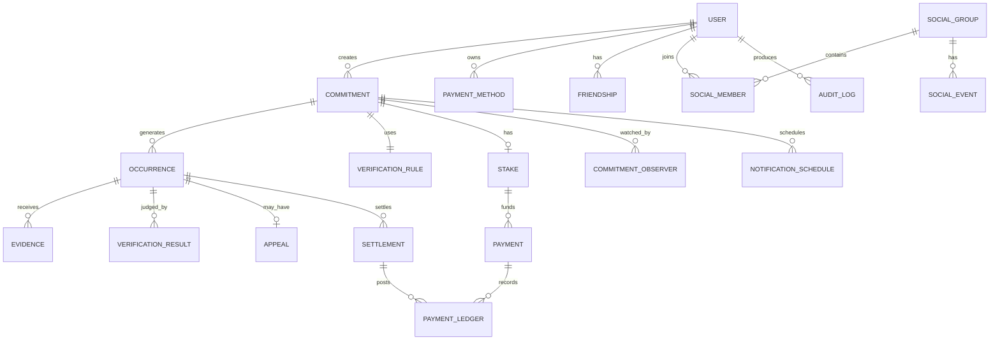

# ERD — 한국형 Commitment App
> 버전: v0.9  
> 목적: MVP 핵심 데이터 모델을 정의한다.

---

## 1. 설계 원칙

- 사용자가 만드는 **Commitment**가 중심 엔터티
- 반복 약속은 `Commitment`와 실제 실행 단위인 `Occurrence`를 분리
- 결제는 약속 전체 선결제, 성공/실패는 회차별 정산
- Verification은 플러그인 구조
- 증거(Evidence), 판정(Verification Result), Appeal은 분리
- 친구/Social은 금전 흐름과 분리
- Server Time을 기준으로 상태를 결정
- 모든 금전 상태 변경은 Ledger로 남김

---

## 2. Mermaid ERD



---

## 3. 핵심 엔터티

### USER
| 필드 | 타입 | 설명 |
|---|---|---|
| id | UUID | PK |
| email | varchar | 이메일 |
| auth_provider | enum | apple/google/email |
| display_name | varchar | 이름 |
| birth_date | date nullable | 미성년 확인 |
| locale | varchar | ko-KR |
| timezone | varchar | Asia/Seoul |
| status | enum | active/suspended/deleted |
| created_at | timestamptz | 생성 |
| updated_at | timestamptz | 수정 |

---

### COMMITMENT
| 필드 | 타입 | 설명 |
|---|---|---|
| id | UUID | PK |
| user_id | UUID | FK |
| title | varchar | 약속명 |
| category | enum | wakeup/workout/study/read/meditate/screen/custom |
| direction | enum | do/avoid |
| schedule_type | enum | one_time/daily/specific_days/x_per_week/custom |
| schedule_json | jsonb | 반복 규칙 |
| start_at | timestamptz | 시작 |
| end_at | timestamptz | 종료 |
| timezone | varchar | 생성 시 고정 |
| strictness | enum | normal/hard |
| extension_allowed | boolean | 연장 허용 |
| status | enum | draft/payment_pending/active/completed/cancelled |
| max_loss_amount | bigint | 전체 최대 손실 |
| currency | char(3) | KRW |
| signed_at | timestamptz | 서명 |
| signature_asset_id | UUID nullable | 서명 이미지 |
| created_at | timestamptz | |
| updated_at | timestamptz | |

---

### OCCURRENCE
반복 약속의 각 실행 회차.

| 필드 | 타입 | 설명 |
|---|---|---|
| id | UUID | PK |
| commitment_id | UUID | FK |
| sequence_no | int | 회차 |
| window_start_at | timestamptz | 수행 시작 |
| deadline_at | timestamptz | 수행/증명 마감 |
| status | enum | scheduled/active/evidence_submitted/reviewing/pass/uncertain/fail/void |
| stake_amount | bigint | 회차당 약속금 |
| failure_reason_code | varchar nullable | 실패 이유 |
| decided_at | timestamptz nullable | 판정 시각 |
| created_at | timestamptz | |

---

### VERIFICATION_RULE
| 필드 | 타입 | 설명 |
|---|---|---|
| id | UUID | PK |
| commitment_id | UUID | FK unique |
| method | enum | photo/gps/timer/self/friend/health/screen_time/timelapse |
| rule_json | jsonb | 방식별 규칙 |
| ai_threshold | numeric nullable | AI 판정 기준 |
| fallback_type | enum nullable | appeal/manual/additional_evidence |
| created_at | timestamptz | |

예시 `rule_json`
```json
{
  "method": "gps",
  "lat": 37.123,
  "lng": 127.123,
  "radius_m": 150,
  "must_enter_before_deadline": true
}
```

---

### EVIDENCE
| 필드 | 타입 | 설명 |
|---|---|---|
| id | UUID | PK |
| occurrence_id | UUID | FK |
| submitted_by_user_id | UUID | FK |
| evidence_type | enum | photo/video/location/timer/self/friend |
| storage_key | varchar nullable | 파일 위치 |
| captured_at | timestamptz nullable | 촬영/측정 시각 |
| received_at | timestamptz | 서버 수신 |
| metadata_json | jsonb | EXIF, 위치, device 등 |
| hash | varchar nullable | 재사용 탐지 |
| retention_until | timestamptz | 삭제 예정 |
| created_at | timestamptz | |

---

### VERIFICATION_RESULT
| 필드 | 타입 | 설명 |
|---|---|---|
| id | UUID | PK |
| occurrence_id | UUID | FK |
| verifier_type | enum | rule/ai/friend/human |
| result | enum | pass/uncertain/fail |
| confidence | numeric nullable | AI 확신 |
| reason_code | varchar | 이유 |
| reason_text | text | 사용자 노출 가능 설명 |
| model_version | varchar nullable | AI 모델 |
| reviewer_user_id | UUID nullable | friend/human |
| created_at | timestamptz | |

---

### STAKE
| 필드 | 타입 | 설명 |
|---|---|---|
| id | UUID | PK |
| commitment_id | UUID | FK |
| per_occurrence_amount | bigint | 회차당 금액 |
| max_total_amount | bigint | 전체 최대 |
| currency | char(3) | KRW |
| settlement_mode | enum | end_of_commitment/per_occurrence |
| recipient_type | enum | platform |
| status | enum | pending/funded/settling/settled/refunded |
| created_at | timestamptz | |

---

### PAYMENT
| 필드 | 타입 | 설명 |
|---|---|---|
| id | UUID | PK |
| user_id | UUID | FK |
| stake_id | UUID nullable | FK |
| provider | varchar | PG |
| provider_payment_key | varchar | PG payment key |
| type | enum | charge/refund/cancel |
| amount | bigint | |
| currency | char(3) | KRW |
| status | enum | requested/succeeded/failed/partial |
| failure_code | varchar nullable | |
| created_at | timestamptz | |
| completed_at | timestamptz nullable | |

---

### PAYMENT_LEDGER
회계/정산 변경을 append-only로 저장.

| 필드 | 타입 | 설명 |
|---|---|---|
| id | UUID | PK |
| user_id | UUID | FK |
| commitment_id | UUID | FK |
| occurrence_id | UUID nullable | FK |
| payment_id | UUID nullable | FK |
| entry_type | enum | deposit/refund_earned/refund_paid/forfeit/reversal |
| amount | bigint | |
| balance_after | bigint nullable | 내부 계산용 |
| created_at | timestamptz | |

---

### SETTLEMENT
| 필드 | 타입 | 설명 |
|---|---|---|
| id | UUID | PK |
| occurrence_id | UUID | FK |
| result | enum | refundable/forfeited/void |
| amount | bigint | |
| status | enum | pending/processed/failed |
| processed_at | timestamptz nullable | |

---

### APPEAL
| 필드 | 타입 | 설명 |
|---|---|---|
| id | UUID | PK |
| occurrence_id | UUID | FK unique |
| user_id | UUID | FK |
| reason_text | text | |
| status | enum | submitted/reviewing/approved/rejected |
| reviewer_type | enum | ai/human |
| reviewer_id | UUID nullable | |
| decision_reason | text nullable | |
| submitted_at | timestamptz | |
| decided_at | timestamptz nullable | |

---

### COMMITMENT_OBSERVER
| 필드 | 타입 | 설명 |
|---|---|---|
| id | UUID | PK |
| commitment_id | UUID | FK |
| observer_user_id | UUID nullable | 가입 친구 |
| external_contact | varchar nullable | 문자/링크 |
| role | enum | viewer/verifier |
| notify_on_success | boolean | |
| notify_on_fail | boolean | |
| created_at | timestamptz | |

---

### FRIENDSHIP
| 필드 | 타입 | 설명 |
|---|---|---|
| id | UUID | PK |
| requester_id | UUID | FK |
| addressee_id | UUID | FK |
| status | enum | pending/accepted/blocked |
| created_at | timestamptz | |

---

### SOCIAL_GROUP / SOCIAL_MEMBER / SOCIAL_EVENT
V2 대비 최소 구조.

SOCIAL_GROUP
- id
- name
- owner_user_id
- created_at

SOCIAL_MEMBER
- group_id
- user_id
- role
- joined_at

SOCIAL_EVENT
- group_id
- user_id
- occurrence_id
- event_type: committed/pass/fail/reaction
- metadata_json
- created_at

---

### NOTIFICATION_SCHEDULE
| 필드 | 타입 | 설명 |
|---|---|---|
| id | UUID | PK |
| commitment_id | UUID | FK |
| occurrence_id | UUID nullable | FK |
| type | enum | before_24h/before_1h/before_10m/deadline/result/refund |
| scheduled_at | timestamptz | |
| status | enum | pending/sent/cancelled/failed |
| created_at | timestamptz | |

---

### AUDIT_LOG
돈/판정 관련 중요 변경 저장.

- id
- actor_type
- actor_id
- entity_type
- entity_id
- action
- before_json
- after_json
- ip
- device_id
- created_at

---

## 4. 주요 상태 머신

### Commitment
```text
draft
  ↓
payment_pending
  ↓ payment success
active
  ↓
completed

draft/payment_pending → cancelled
active → cancelled (future occurrences only)
```

### Occurrence
```text
scheduled
  ↓
active
  ↓
evidence_submitted
  ↓
reviewing
  ├─→ pass
  ├─→ uncertain
  └─→ fail

uncertain → evidence_submitted / appeal
fail → appeal → pass | void | fail
```

### Stake
```text
pending → funded → settling → settled
                 └→ refunded
```

---

## 5. 데이터 보존

- Evidence 원본: 판정 및 Appeal 기간 종료 후 삭제
- AI 분석 결과: 장기 보존 가능, 개인정보 최소화
- 결제/정산: 법적 보존기간 준수
- Audit Log: 장기 보존
- 탈퇴: 법정보존 대상 제외 개인정보 삭제/비식별
