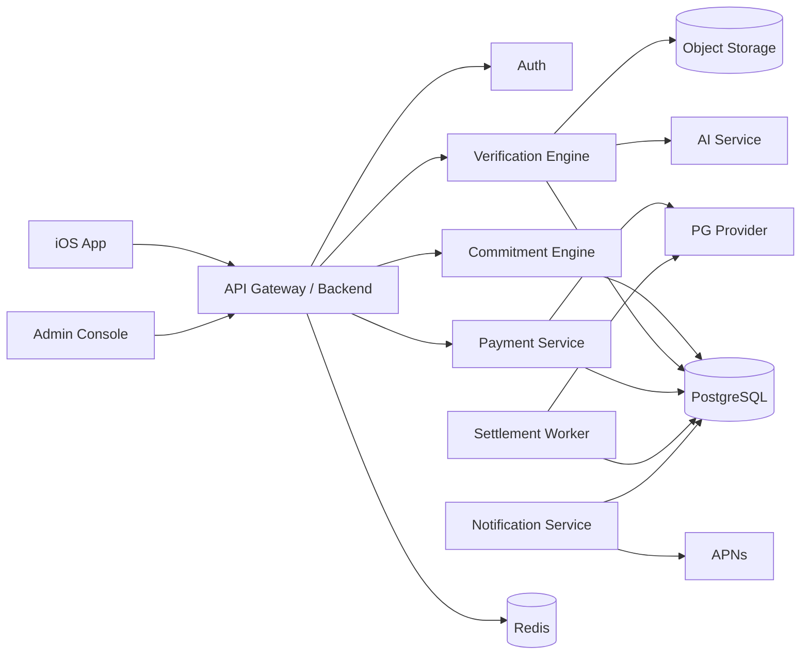

# TRD — Technical Requirements Document
> 버전: v1.0 (Phase 3 개정)  
> 목적: MVP 구현을 위한 기술 아키텍처, API, 스택, 인프라, 배포/운영 기준을 정의한다.

---

## 1. 권장 기술 스택

### iOS
- Swift
- SwiftUI
- async/await
- Combine 최소화
- CoreLocation
- UserNotifications
- AVFoundation
- BackgroundTasks
- StoreKit: 구독 사용 시
- HealthKit/FamilyControls: P1

### Backend
권장안:
- **TypeScript + NestJS**
- PostgreSQL
- Redis
- BullMQ / Queue
- S3-compatible Object Storage
- OpenAPI

대안:
- FastAPI + Python
- AI 관련 코드는 별도 Python worker로 분리 가능

### Infra
- AWS or GCP
- Managed Postgres
- Managed Redis
- Object Storage
- CDN
- Container Runtime
- Secrets Manager
- Cloud Logging/Monitoring

### AI
- Vision-capable model
- Safety/Goal classifier
- Structured JSON output
- 모델 버전 로그 저장
- confidence threshold 관리

### Payment
- 국내 PG 1차 선정 필요
- 결제/전액취소·전액환불/거래조회 API 지원 필수. MONEY V1은 부분환불을 요구하지 않는다.
- webhook 필수
- idempotency 지원

---

## 2. 아키텍처



---

## 3. 서비스 모듈

### Auth Module
- OAuth
- email verification
- session/JWT
- device registration

### Commitment Module
- template
- custom
- schedule
- occurrence generation
- contract signature

### Verification Module
- photo
- GPS
- timer
- self
- friend
- PASS/UNCERTAIN/FAIL

### Payment Module
- initial charge
- refund
- retry
- webhook
- reconciliation

### Settlement Module
- occurrence result → ledger
- commitment end → refund total
- appeal reversal

### Social Module
- friendship
- observer
- friend verify
- V2 group

### Notification Module
- scheduled push
- result push
- retry

### Admin Module
- appeal
- payment
- manual correction
- audit

---

## 4. API 초안

### Auth
```http
POST /v1/auth/apple
POST /v1/auth/google
POST /v1/auth/email/signup
POST /v1/auth/email/verify
```

### Commitment
```http
GET  /v1/commitment-templates
POST /v1/commitments/quote            # MONEY 모드에서만 호출
POST /v1/commitments                  # 생성 + 활성화 (SELF/SOCIAL/MONEY 분기)
GET  /v1/commitments
GET  /v1/commitments/{id}
GET  /v1/commitments/{id}/terms      # server-issued immutable financial/terms snapshot
POST /v1/commitments/{id}/terms/accept
GET  /v1/commitments/{id}/contract   # accepted snapshot
GET  /v1/commitments/{id}/cancel     # owner preview (effectiveAt, binding/void counts, MONEY amounts)
POST /v1/commitments/{id}/cancel     # unsigned Phase 5A or active future-only cutoff. idempotent. completed 거부
POST /v1/internal/jobs/money-maintenance   # x-internal-job-secret (JWT/quote/webhook과 분리)
GET  /v1/admin/money/cases                 # x-admin-secret. refund_delayed | unknown_payment | expired_awaiting_refund
GET  /v1/admin/money/cases/{id}
POST /v1/admin/money/cases/{id}/retry
POST /v1/admin/money/cases/{id}/reconcile
```

`POST /v1/commitments` 요청 payload의 핵심 필드:
```jsonc
{
  "enforcementMode": "SELF | SOCIAL | MONEY",
  "quoteId": "qt_..."        // MONEY 전용, 그 외에는 생략 (전송 시 서버가 거부)
  // ... goal / schedule / verification / signature 등
}
```

서버는 mode-별로 아래를 강제한다:
- **SELF** → quoteId 금지, Stake row 미생성.
- **SOCIAL** → quoteId 금지, verifier 관계 없이 활성화 거부(`FRIEND_NOT_SELECTED`).
- **MONEY** → quoteId 필수, `consumed_quotes`에 소비 기록, Stake row 생성.

### Stake Policy
```http
GET /v1/stake-policy         # 현재 사용자에게 적용되는 티어 정보 + 상한 + 추천 금액
```

### Occurrence
```http
GET /v1/occurrences/today
GET /v1/occurrences/{id}
GET /v1/occurrences/{id}/result       # 최신 verification 결과
POST /v1/occurrences/{id}/self-verify
```

### Evidence
```http
POST /v1/occurrences/{id}/evidence/upload-url
POST /v1/occurrences/{id}/evidence        # multi-modal: photo/gps/timer/self
POST /v1/occurrences/{id}/timer/start
POST /v1/occurrences/{id}/timer/heartbeat
POST /v1/occurrences/{id}/timer/finish
GET  /v1/occurrences/{id}/evidence
GET  /v1/occurrences/{id}/evidence/{evidenceId}/asset
```

### Notifications / Recap
```http
POST /v1/devices/tokens
POST /v1/devices/tokens/unregister
GET  /v1/notifications/preferences
POST /v1/notifications/preferences
GET  /v1/recaps/latest
GET  /v1/recaps/{localWeekStart}
```

### Appeal
```http
POST /v1/occurrences/{id}/appeals
GET  /v1/occurrences/{id}/appeal
GET  /v1/appeals/{id}
GET  /v1/admin/appeals
GET  /v1/admin/appeals/{id}
POST /v1/admin/appeals/{id}/approve
POST /v1/admin/appeals/{id}/reject
```

### Friend
```http
POST /v1/friends/invite
POST /v1/friends/{id}/accept
POST /v1/occurrences/{id}/friend-verification
```

### Payment / Settlement (MONEY 모드 전용)
```http
POST /v1/commitments/{id}/pay        # upfront charge = stake.maxTotalAmount; 성공 시 payment_pending → signature_pending (active 아님)
POST /v1/commitments/{id}/sign       # 결제+funding 필수, idempotent. signature_pending → active
GET  /v1/commitments/{id}/money      # 파생 MoneyView (money status + 합계)
GET  /v1/payments/{id}
GET  /v1/settlements
POST /v1/commitments/{id}/settle     # on-demand 정산 / 환불 재시도 (idempotent)
POST /v1/webhooks/payment            # 서명 검증 + (provider, eventId) 중복 방지
```

Money status (파생값, `deriveMoneyStatus`):
`payment_pending` · `payment_failed` · `funded` · `refund_scheduled` · `refund_in_progress` · `refunded` · `refund_delayed` · `settled_no_refund`
→ 결제 중 / 결제 실패 / 약속금 걸림 / 환불 예정 / 환불 중 / 환불 완료 / 환불 지연 / 정산 완료
전액 몰수(all FAIL)는 `settled_no_refund` (`정산 완료`). “환불 완료 0원”을 쓰지 않는다. 환불 호출도 하지 않는다.

---

## 5. Commitment Quote API (MONEY 모드 전용)

결제 직전 서버가 authoritative quote를 생성한다. 이 API는 오직 MONEY 모드 Commitment에만 호출된다. SELF/SOCIAL 모드는 quote를 생성하지도, 검증하지도 않는다.

Request:
```json
{
  "schedule": {
    "type": "specific_days",
    "days": ["MON", "WED", "FRI"],
    "start_date": "2026-09-07",
    "end_date": "2026-09-13"
  },
  "stake_per_occurrence": 10000
}
```

Response:
```json
{
  "quoteId": "qt_...",
  "occurrence_count": 3,
  "stake_per_occurrence": 10000,
  "max_loss": 30000,
  "currency": "KRW",
  "quote_expires_at": "2026-09-02T14:00:00Z"
}
```

- Quote는 `QUOTE_SIGNING_SECRET`으로 HMAC 서명된 opaque 토큰(`qt_...`).
- `QUOTE_SIGNING_SECRET`은 JWT 시크릿과 반드시 다른 값이어야 한다. 서버는 부팅 시 이 조건을 검증한다.
- 각 quote는 서버가 발급하는 unique `jti`를 포함한다.
- `consumed_quotes` 테이블 (`jti` PK)로 첫 사용에서만 소비된다. 재사용 시 서버는 `QUOTE_ALREADY_CONSUMED`로 거부한다.
- 클라이언트 계산값을 신뢰하지 않는다.

## 5b. Stake Policy API

```http
GET /v1/stake-policy
```
Response:
```json
{
  "currentTier": "TIER_1",
  "maxPerOccurrence": 30000,
  "maxPerCommitment": 150000,
  "rollingMonthlyLossCap": 300000,
  "suggestedAmounts": [3000, 5000, 10000, 30000]
}
```

- 값은 서버 설정에서 로드된다. 코드 하드코딩 금지.
- 모든 신규 사용자는 TIER_1으로 시작한다.
- 자동 티어 승격은 MVP에 없다.
- Quote 발급 시 서버는 currentTier의 상한을 재검증한다. 클라이언트가 상한을 조작해도 서버가 거부한다.

---

## 6. 사진 검증 파이프라인

1. App에서 camera-only 촬영
2. 로컬 메타데이터 생성
3. presigned URL 발급
4. object storage 업로드
5. evidence row 생성
6. queue enqueue
7. AI worker
8. structured result validation
9. PASS/UNCERTAIN/FAIL 저장
10. occurrence state transition
11. push
12. retention policy schedule

### AI Prompt 원칙
- 목표/증명 규칙과 사진이 일치하는지만 판단
- 사람의 민감한 속성 추론 금지
- 불확실하면 UNCERTAIN
- JSON schema 강제

---

## 7. GPS 검증

### iOS
- CoreLocation, when-in-use.
- 목적지 지정은 **MapKit 기반 target picker**를 통해서만 이뤄진다.
- Target payload에는 반드시 `userSelected: true`가 포함되어야 한다. 서버는 이 flag가 없거나 좌표가 `(0,0)`이면 활성화를 거부한다 (`GPS_TARGET_NOT_SELECTED`).
- 사용자가 자신의 현재 위치를 target으로 고를 수 있고, 지도 롱프레스로 임의 지점을 고를 수도 있으며, 텍스트 검색은 MVP 이후.
- Check-in 시 고정밀도(`kCLLocationAccuracyBest`) 요청.
- 사용자 동의 없이 지속 추적 금지.
- DEBUG 빌드는 Simulator 환경을 위해 mock target(`userSelected: true`, 명시된 좌표)을 강제 주입 가능.

### 서버
Haversine distance:
```text
distance(user_latlng, target_latlng) <= radius_m
```

검증:
- `accuracy_m <= threshold` (예: 100m). 초과 시 UNCERTAIN.
- `captured_at within window`
- `received_at <= deadline + allowed_network_grace`
- impossible jump / mock-location 힌트 등 anomaly → UNCERTAIN (자동 monetary FAIL 금지).
- 계산 결과와 target을 `verification_result`에 함께 저장.

---

## 8. Timer 검증

### 시작
`POST /v1/occurrences/{id}/timer/start` → 서버가 `focus_timer_sessions.id` 발급 (session token).

### 진행
- 30~60초마다 `POST /v1/occurrences/{id}/timer/heartbeat` (session_id 포함).
- 서버는 마지막 heartbeat 시각, 총 count, 관측 최대 gap을 갱신한다.
- background 전환 및 app termination 이벤트를 heartbeat payload에 실어 보고한다.

### 종료
`POST /v1/occurrences/{id}/timer/finish` → 서버가 elapsed(server), heartbeat count, max gap, background 전환 수를 계산.

### 결과
- 규칙 충족 + `max_gap <= 90s` → **PASS**
- 명확한 조기 종료 (`elapsed < planned - grace`) → **FAIL**
- 네트워크 gap 큼 / background 잦음 / heartbeat 부족 → **UNCERTAIN**
- 시스템 장애/서비스 미응답 → `system_hold`, monetary FAIL 절대 금지.

---

## 9. 스케줄러

### Occurrence 생성
- commitment 활성화 시 가까운 미래 N개 생성
- daily job으로 horizon 연장
- RRULE 또는 custom JSON

### Deadline worker
- 주기적으로 deadline 경과 active occurrence를 스캔한다.
- Evidence 존재 or 검증 중 → `reviewing`으로 유지.
- Evidence 없음 → candidate FAIL로 이동.
- Candidate FAIL을 최종 FAIL로 확정하기 전에:
  - 알려진 시스템 outage 없음
  - Verification 인프라 정상
  - grace 조건 없음
- 시스템 장애/인프라 장애면 상태는 `system_hold` 또는 `uncertain`. **어떠한 경우에도 monetary FAIL을 만들지 않는다.**
- MVP는 interval-based 스캔(예: 60초)으로 시작하고, BullMQ delayed job 도입은 이후 최적화.

### Notification scheduler
- 24h/1h/10m/deadline

---

## 10. 결제/정산 구현

### 선결제
- quote 생성
- user confirm
- PG charge
- webhook success
- commitment activate

### 정산 (MONEY V1)
계약 결과만 정산한다. 회차 PASS/FAIL은 행동 상태다.

- SUCCESS / 시작 전·시스템 취소 → 전액 refund 1회
- FAIL / 시작 후 자진 포기 → 전액 forfeit 1회, PG 환불 호출 없음
- 부분환불 provider 호출은 V1 경로에서 금지
- 레거시 회차 비례 정산(`end_of_commitment`)은 신규 생성에서 격리 (비출시)

### Appeal reversal
FAIL → VOID/PASS 시:
- forfeited ledger reversal
- 추가 refund

### 필수
- idempotency key
- webhook dedupe
- payment reconciliation
- DB transaction
- distributed lock

---

## 11. 구독

MVP에서는 약속금 결제와 구독 결제를 분리한다.

### Free 예시
- 활성 약속 1개
- 사진/GPS/Timer
- 기본 리캡

### Premium 예시
- 활성 약속 4개
- 친구 검증
- 고급 통계
- Apple Health/Screen Time

### Pro 예시
- 무제한
- AI 약속 설계
- 고급 코칭
- Circle

구독 가격은 별도 MRD 테스트 항목으로 둔다.

---

## 12. 로깅/모니터링

### 핵심 메트릭
- API latency
- 5xx
- queue lag
- AI timeout
- AI uncertain rate
- payment success rate
- refund failure rate
- webhook delay
- wrong-fail count
- appeal approval rate

### Alert
- refund failure > threshold
- payment mismatch
- duplicate settlement
- verification worker down
- occurrence fail spike
- APNs failure spike

---

## 13. 테스트 전략

### Unit
- schedule
- max_loss
- state machine
- refund calculation
- distance
- timer

### Integration
- PG sandbox
- webhook
- object storage
- AI JSON parsing
- notification

### E2E
- one-time photo PASS
- repeating mixed PASS/FAIL
- payment fail
- refund fail
- appeal reversal
- timezone change
- offline evidence
- system outage hold

### Chaos/Failure
- AI unavailable
- PG unavailable
- Redis unavailable
- delayed webhook
- duplicate webhook
- queue retry

---

## 14. 보안

- JWT short-lived + refresh
- Keychain
- certificate pinning 검토
- admin MFA
- presigned upload
- PII masking in logs
- payment card raw data 저장 금지
- rate limiting
- WAF
- audit append-only

---

## 15. 배포

### Environments
- dev
- staging
- prod

### CI/CD
- lint
- unit
- integration
- migration check
- security scan
- deploy
- smoke test

### DB Migration
- backward compatible 우선
- destructive migration 금지
- ledger table 변경 특별 리뷰

---

## 16. MVP 구현 순서 (실제 진행 반영)

### Phase 1 — 재무 안전 기반
- Ledger append-only
- state machine
- PaymentProvider / VerificationProvider 추상화
- distributed lock
- Auth
- design system

### Phase 2 — Onboarding + Commitment Creation
- 온보딩
- Templates
- Wizard (Goal → Schedule → Verification → Proof Rule → Signature)
- Server-authoritative quote (초기 버전)
- Home / Today

### Phase 2.1 — Hardening
- GPS target `userSelected` 강제
- Signature 이미지 미보관 (ritual only)
- `QUOTE_SIGNING_SECRET` 분리
- Quote `jti` + single-use (`consumed_quotes`)
- Home 오늘 at-risk 서버 authoritative
- 스케줄/goal-safety 테스트 확장

### Phase 3 — 강제력 모드 + 실 증명 시스템 (현재)
- Enforcement mode: SELF / SOCIAL / MONEY
- Stake는 MONEY 전용 (0..1)
- StakePolicy 서버 authoritative + `/v1/stake-policy`
- Wizard에 Enforcement 단계 추가
- Photo capture (AVFoundation), image hash, evidence upload
- MapKit GPS target picker + CoreLocation proof + Haversine
- Focus Timer server session + heartbeat
- Self Verify
- Deadline worker (system_hold-safe)
- PASS / UNCERTAIN / FAIL 결과 UI (mode-aware)
- Home mode-aware 렌더링

### Phase 4 — Payment/Settlement (완료, MockPaymentProvider 기준)
- MONEY activation gating: `payment_pending` → charge 성공 → `signature_pending` → `/sign` → `active`. 결제 성공만으로 활성화하지 않음.
- Rolling loss cap: 미종료 funded/unknown 건은 maxTotal 전액 reserve, 종료 건은 실현 forfeit만. 동일 Commitment를 이중 계산하지 않음.
- 서명 전 취소/만료/전액 환불, JobLease maintenance, admin money ops (Phase 5A)
- PaymentService: charge / full·partial refund / webhook dedupe / idempotency / refund retry / reconcile hook
- SettlementService V1: 계약 SUCCESS → 전액 `refund_paid`, 계약 FAIL → 전액 `forfeit`. 회차 `refund_earned` 없음.
- 레거시 pro-rata(`end_of_commitment`)는 신규 생성에서 격리.
- Ledger append-only, 모든 금전 변동은 LedgerService 경유, `(entry_type, idempotency_key)` 유일
- StakePolicy rolling monthly cap을 정산된 forfeit 합계로 실제 적용
- iOS: 결제 단계(약속금 1건/총 횟수/엄격도/지금 결제할 금액), money status 칩, History money summary
- 실제 한국 PG 연동은 provider/credentials 확정 후 (`KoreanPgPaymentProvider` 골격만 존재)

### Phase 5A — Unsigned recovery / money ops (완료, MockPaymentProvider)
- `signature_expires_at` (기본 30분, `SIGNATURE_EXPIRY_SECONDS`)
- 서명 전 취소/만료: 미충전은 no-PG, 충전은 전액 환불 1회. JobLease maintenance.
- Admin money cases + append-only audit. `INTERNAL_JOB_SECRET` / `ADMIN_API_SECRET` 분리.

### Phase 5B — MONEY Appeal (완료, MockPaymentProvider)
- `APPEAL_WINDOW_SECONDS` (기본 7일). owner submit/status + admin pending/detail/approve/reject
- 대기 Appeal은 회차·약속 정산 완료를 차단. 정산 전 승인 → correctedResult 소비, reversal 없음
- 몰수 후 승인 → `reversal:<occ>` 1건 + `refund:appeal:<occ>` 추가 환불 1건. 합산 종료 환불은 그대로 1회
- originalResult / effectiveResult 분리. 원 VerificationResult·Settlement·Ledger 불변
- 누적 환불 ≤ 선결제. cap credit는 추가 환불 성공 후. 실패는 refund_delayed + retry/reconcile
- iOS: MONEY FAIL `[결과에 이의 제기하기]`, 검토 중 / 승인됨·추가 환불 / 기각됨

### Phase 5C — Notifications / Weekly Recap / evidence retention (완료, MockPushProvider)
- Device token hash+encrypt (`PUSH_TOKEN_ENCRYPTION_SECRET`), category prefs, transactional outbox, MockPushProvider
- Weekly Recap: 사용자 타임존 직전 Mon–Sun, `(userId, localWeekStart)`, owner API + iOS
- Evidence raw 삭제: 최종 유효 판정 +30일, hold 조건, 메타 보존. money_maintenance lease 확장
- 실 APNs / 실 PG / 실 vision / admin web / 소셜은 제외

### Phase 5D — Active cancellation (완료)
- 활성 약속 미래 회차만 취소. SELF 즉시 / MONEY 24h notice. 기존 `/cancel` + preview. VOID는 maintenance, 합산 환불은 기존 settlement.

### Phase 5E — Compliance / financial finality (완료, 실 KCP 없음)
- 취소 컷오프=`cancellationRequestedAt`. FAIL는 persisted `appealDeadlineAt` 또는 기각 후에만 확정.
- 결제 전 terms snapshot, 서버 19+ 게이트, 운영 MONEY fail-closed. Provider=KCP, method=CARD/KAKAOPAY 분리.
- Admin accounting export. Launch gates는 서면 증거 없이 체크하지 않음.

### Phase 5F — MONEY V1 contract (완료, 실 KCP 없음)
- `1 Commitment = 1 Stake = 1 charge = 1 outcome`. 부분환불 없음. 엄격도+Grace는 서버 계산.
- 시작 전/시스템 취소 전액 환불, 시작 후 자진 포기 전액 forfeit. x_per_week 기간 내 보충.
- 신규 생성은 `contract_v1`만. 레거시 회차 비례는 격리.

### Phase 5F remaining (예정)
- 실 KCP 네트워크/자격증명, StoreKit entitlement, 실 APNs, 실 vision, admin web UI, 소셜

### Phase 6 — Social 완전판 + Friend Verify (예정)

### Phase 7 — Hardening / analytics / safety / app review (예정)

---

## 17. 출시 전 기술 체크리스트

- [ ] PG sandbox E2E (실 PG provider 확정 후)
- [x] MONEY V1 전액 환불/전액 몰수 (MockPaymentProvider). 부분환불은 V1 비요구.
- [x] 중복 webhook 방지 (`payment_webhook_events (provider, event_id)` unique)
- [x] 중복 charge / 중복 정산 / 중복 환불 방지 (idempotency key)
- [x] 장애 중 자동 FAIL 차단 (Verification/Deadline)
- [x] AI UNCERTAIN 처리 (Mock provider, PASS/UNCERTAIN/FAIL)
- [x] Appeal reversal (Phase 5B, MockPaymentProvider)
- [x] Evidence auto-delete (Phase 5C, Mock storage, 30일 + hold)
- [x] Stake 상한 server-side validation (StakePolicy)
- [x] `QUOTE_SIGNING_SECRET` 분리 및 single-use quote
- [x] SELF/SOCIAL/MONEY 강제력 모드 분기
- [x] GPS target `userSelected` 강제
- [x] timezone freeze test
- [x] 활성 약속 취소 (컷오프=`cancellationRequestedAt`)
- [x] 결제 전 약관 스냅샷 / 19+ 게이트 / 운영 MONEY fail-closed (Phase 5E)
- [ ] offline evidence retry
- [x] 위험 목표 filter (Goal Safety classifier)
- [ ] monitoring dashboard
- [ ] admin audit log UI
