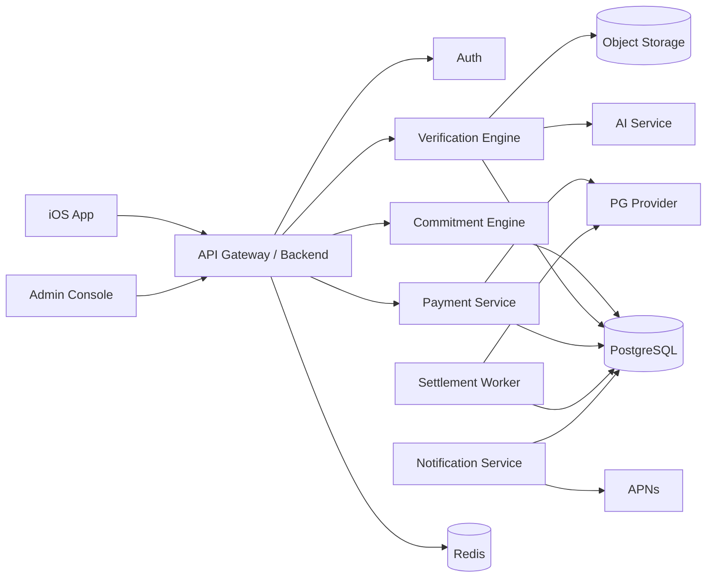

# TRD — Technical Requirements Document
> 버전: v0.9  
> 목적: MVP 구현을 위한 기술 아키텍처, API, 스택, 인프라, 배포/운영 기준을 정의한다.

---

## 1. 권장 기술 스택

### iOS
- Swift
- SwiftUI
- async/await
- Combine 최소화
- CoreLocation
- UserNotifications
- AVFoundation
- BackgroundTasks
- StoreKit: 구독 사용 시
- HealthKit/FamilyControls: P1

### Backend
권장안:
- **TypeScript + NestJS**
- PostgreSQL
- Redis
- BullMQ / Queue
- S3-compatible Object Storage
- OpenAPI

대안:
- FastAPI + Python
- AI 관련 코드는 별도 Python worker로 분리 가능

### Infra
- AWS or GCP
- Managed Postgres
- Managed Redis
- Object Storage
- CDN
- Container Runtime
- Secrets Manager
- Cloud Logging/Monitoring

### AI
- Vision-capable model
- Safety/Goal classifier
- Structured JSON output
- 모델 버전 로그 저장
- confidence threshold 관리

### Payment
- 국내 PG 1차 선정 필요
- 결제/취소/부분환불 API 지원 필수
- webhook 필수
- idempotency 지원

---

## 2. 아키텍처



---

## 3. 서비스 모듈

### Auth Module
- OAuth
- email verification
- session/JWT
- device registration

### Commitment Module
- template
- custom
- schedule
- occurrence generation
- contract signature

### Verification Module
- photo
- GPS
- timer
- self
- friend
- PASS/UNCERTAIN/FAIL

### Payment Module
- initial charge
- refund
- retry
- webhook
- reconciliation

### Settlement Module
- occurrence result → ledger
- commitment end → refund total
- appeal reversal

### Social Module
- friendship
- observer
- friend verify
- V2 group

### Notification Module
- scheduled push
- result push
- retry

### Admin Module
- appeal
- payment
- manual correction
- audit

---

## 4. API 초안

### Auth
```http
POST /v1/auth/apple
POST /v1/auth/google
POST /v1/auth/email/signup
POST /v1/auth/email/verify
```

### Commitment
```http
GET  /v1/commitment-templates
POST /v1/commitments/draft
PUT  /v1/commitments/{id}
POST /v1/commitments/{id}/quote
POST /v1/commitments/{id}/pay
POST /v1/commitments/{id}/sign
POST /v1/commitments/{id}/activate
GET  /v1/commitments/{id}
GET  /v1/commitments
POST /v1/commitments/{id}/cancel
```

### Occurrence
```http
GET /v1/occurrences/today
GET /v1/occurrences/{id}
POST /v1/occurrences/{id}/self-verify
```

### Evidence
```http
POST /v1/occurrences/{id}/evidence/upload-url
POST /v1/occurrences/{id}/evidence
POST /v1/occurrences/{id}/gps-checkin
POST /v1/occurrences/{id}/timer/start
POST /v1/occurrences/{id}/timer/heartbeat
POST /v1/occurrences/{id}/timer/finish
```

### Appeal
```http
POST /v1/occurrences/{id}/appeals
GET  /v1/appeals/{id}
```

### Friend
```http
POST /v1/friends/invite
POST /v1/friends/{id}/accept
POST /v1/occurrences/{id}/friend-verification
```

### Payment
```http
GET  /v1/payments/{id}
GET  /v1/settlements
POST /v1/webhooks/payment
```

---

## 5. Commitment Quote API

결제 직전 서버가 authoritative quote를 생성한다.

Request:
```json
{
  "schedule": {
    "type": "specific_days",
    "days": ["MON", "WED", "FRI"],
    "start_date": "2026-09-07",
    "end_date": "2026-09-13"
  },
  "stake_per_occurrence": 5000
}
```

Response:
```json
{
  "occurrence_count": 3,
  "stake_per_occurrence": 5000,
  "max_loss": 15000,
  "currency": "KRW",
  "quote_expires_at": "2026-09-02T14:00:00Z"
}
```

클라이언트 계산값을 신뢰하지 않는다.

---

## 6. 사진 검증 파이프라인

1. App에서 camera-only 촬영
2. 로컬 메타데이터 생성
3. presigned URL 발급
4. object storage 업로드
5. evidence row 생성
6. queue enqueue
7. AI worker
8. structured result validation
9. PASS/UNCERTAIN/FAIL 저장
10. occurrence state transition
11. push
12. retention policy schedule

### AI Prompt 원칙
- 목표/증명 규칙과 사진이 일치하는지만 판단
- 사람의 민감한 속성 추론 금지
- 불확실하면 UNCERTAIN
- JSON schema 강제

---

## 7. GPS 검증

### iOS
- CoreLocation
- when-in-use
- check-in 시 고정밀도 요청
- 사용자 동의 없이 지속 추적 금지

### 서버
Haversine distance:
```text
distance(user_latlng, target_latlng) <= radius_m
```

검증:
- accuracy_m <= threshold
- captured_at within window
- received_at <= deadline + allowed_network_grace
- impossible jump heuristic

---

## 8. Timer 검증

### 시작
서버가 session token 발급.

### 진행
- 30~60초 heartbeat
- background 전환 기록
- app termination 기록

### 종료
- elapsed server time
- heartbeat gap
- policy violation

### 결과
- 규칙 충족 → PASS
- 경계/네트워크 이슈 → UNCERTAIN
- 명확한 중단 → FAIL

---

## 9. 스케줄러

### Occurrence 생성
- commitment 활성화 시 가까운 미래 N개 생성
- daily job으로 horizon 연장
- RRULE 또는 custom JSON

### Deadline worker
- deadline 경과 occurrence 스캔
- evidence 없음 → candidate FAIL
- 시스템 상태 확인
- grace 종료 후 FAIL 확정

### Notification scheduler
- 24h/1h/10m/deadline

---

## 10. 결제/정산 구현

### 선결제
- quote 생성
- user confirm
- PG charge
- webhook success
- commitment activate

### 정산
각 occurrence:
- PASS → refundable ledger
- FAIL → forfeited ledger
- VOID → refundable ledger

기간 종료:
```text
refund_total = total_deposit - forfeited_total
```

refund_total > 0:
- PG 부분환불/취소

### Appeal reversal
FAIL → VOID/PASS 시:
- forfeited ledger reversal
- 추가 refund

### 필수
- idempotency key
- webhook dedupe
- payment reconciliation
- DB transaction
- distributed lock

---

## 11. 구독

MVP에서는 약속금 결제와 구독 결제를 분리한다.

### Free 예시
- 활성 약속 1개
- 사진/GPS/Timer
- 기본 리캡

### Premium 예시
- 활성 약속 4개
- 친구 검증
- 고급 통계
- Apple Health/Screen Time

### Pro 예시
- 무제한
- AI 약속 설계
- 고급 코칭
- Circle

구독 가격은 별도 MRD 테스트 항목으로 둔다.

---

## 12. 로깅/모니터링

### 핵심 메트릭
- API latency
- 5xx
- queue lag
- AI timeout
- AI uncertain rate
- payment success rate
- refund failure rate
- webhook delay
- wrong-fail count
- appeal approval rate

### Alert
- refund failure > threshold
- payment mismatch
- duplicate settlement
- verification worker down
- occurrence fail spike
- APNs failure spike

---

## 13. 테스트 전략

### Unit
- schedule
- max_loss
- state machine
- refund calculation
- distance
- timer

### Integration
- PG sandbox
- webhook
- object storage
- AI JSON parsing
- notification

### E2E
- one-time photo PASS
- repeating mixed PASS/FAIL
- payment fail
- refund fail
- appeal reversal
- timezone change
- offline evidence
- system outage hold

### Chaos/Failure
- AI unavailable
- PG unavailable
- Redis unavailable
- delayed webhook
- duplicate webhook
- queue retry

---

## 14. 보안

- JWT short-lived + refresh
- Keychain
- certificate pinning 검토
- admin MFA
- presigned upload
- PII masking in logs
- payment card raw data 저장 금지
- rate limiting
- WAF
- audit append-only

---

## 15. 배포

### Environments
- dev
- staging
- prod

### CI/CD
- lint
- unit
- integration
- migration check
- security scan
- deploy
- smoke test

### DB Migration
- backward compatible 우선
- destructive migration 금지
- ledger table 변경 특별 리뷰

---

## 16. MVP 구현 순서

### Phase 1
- Auth
- templates
- Commitment draft
- schedule
- Home

### Phase 2
- Photo evidence
- AI verify
- PASS/FAIL

### Phase 3
- Payment
- Stake
- Settlement/Refund

### Phase 4
- GPS/Timer
- Notifications

### Phase 5
- Appeal/Admin
- Friend Verify
- Weekly Recap

### Phase 6
- Hardening
- analytics
- safety filter
- app review preparation

---

## 17. 출시 전 기술 체크리스트

- [ ] PG sandbox E2E
- [ ] 부분환불 검증
- [ ] 중복 webhook 방지
- [ ] 장애 중 자동 FAIL 차단
- [ ] AI UNCERTAIN 처리
- [ ] Appeal reversal
- [ ] Evidence auto-delete
- [ ] max_loss server-side validation
- [ ] timezone test
- [ ] offline evidence retry
- [ ] 위험 목표 filter
- [ ] monitoring dashboard
- [ ] admin audit log
